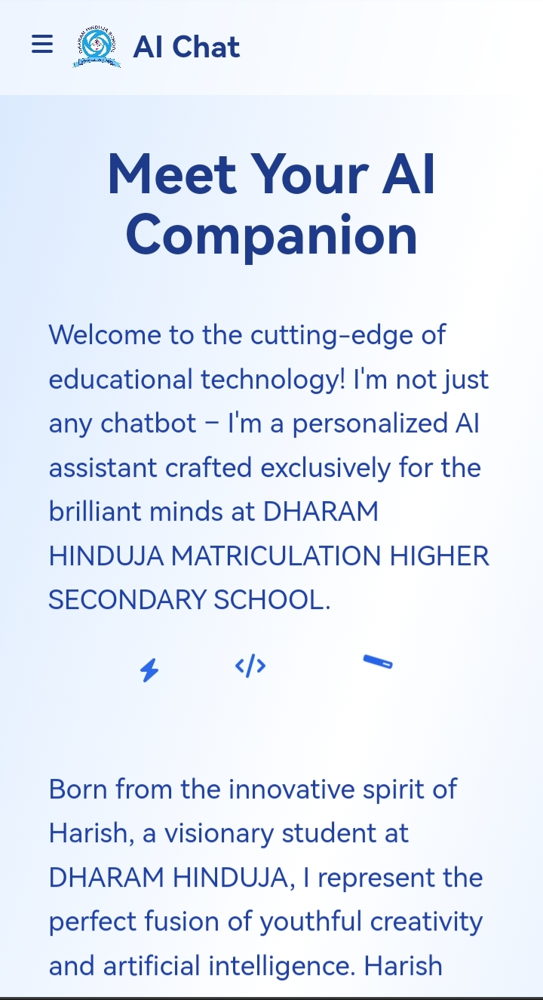

# 🤖💬 AI Chat Interface 🏫📚

## Dharam Hinduja School Edition
> 💡 Empowering Minds, Igniting Futures, One Chat at a Time! 💬

## ⭐ Features

- **💬 Intelligent Conversational AI**: Engage in thought-provoking discussions with our AI assistant.
- **🎨 Sleek, Animated UI**: Enjoy a visually stunning interface with smooth animations.
- **📱 Fully Responsive**: Seamless experience across all devices - desktop, tablet, and mobile.
- **🔍 Multi-Section Navigation**: Easily switch between Home, About, and Contact sections.
- **🔒 User-Friendly Reporting**: Built-in system for reporting issues or inappropriate content.
- **📋 One-Click Copying**: Instantly copy AI responses to your clipboard.
- **🔄 Response Regeneration**: Not satisfied? Regenerate AI responses with a single click.
- **💾 Local Message Storage**: User and AI messages are stored locally to improve AI responses. Clear your chat history anytime by clicking the delete icon in the header—your privacy matters! 🔏

## 🛠️ Technologies

This project leverages a powerful stack of modern web technologies:

  
  
  
  
  

---

## 🚀 Features That'll Blow Your Mind

| 🧠 Smart AI | 🎨 Awesome UI | 📱 Works Everywhere |
|:-----------:|:-------------:|:-------------------:|
| Ask anything about our school, and get instant, accurate answers! | Eye-candy design that makes learning a visual treat. | Whether you're on your phone, tablet, or computer, we're there! |

| 🔍 Easy to Use | 🛡️ Safe & Secure | 🔄 Quick Refresh |
|:--------------:|:----------------:|:----------------:|
| So simple, even your grandma could use it! (But it's for students, sorry grandma!) | Your data is treated like a state secret. Fort Knox level! | Get the latest info faster than you can say "update"! |

---

## 💥 Blast Off: How to Use Our Chat

1. **💬 Chat Interface:** Simply type your question or prompt in the input field and hit send.
2. **🗺️ Navigation:** Use the menu button (top-left) to switch between different sections.
3. **🚨 Reporting:** Found an issue? Use the flag icon to report problematic content.
4. **📋 Copy & Regenerate:** Easily copy or regenerate AI responses using the provided buttons.
5. **🗑️ Clear History:** Want to start fresh? Click the delete icon in the header to clear your chat history and protect your privacy.

---

## 📸 Project Showcase

  
  

---

## 🌈 Welcome to the Future of Learning!

Imagine a world where knowledge is just a chat away. That's what we've created here at Dharam Hinduja School! Our AI Chat Interface is not just a project; it's a revolution in how students interact with information.

## 👨‍💻 The Mastermind Behind the Magic

  <h3>🌟 Harish: The Code Wizard 🧙‍♂️</h3>
  
<em>Turning caffeine into code since 2009</em>

  
  

> This innovative project was brought to life by **Harish**, a visionary student at Dharam Hinduja Matriculation Higher Secondary School. Harish's passion for technology and education shines through in every aspect of this AI Chat Interface.

---

## 📞 Reach Out and Touch Base

| 📧 Shoot Us an Email | 📞 Give Us a Ring | 🌐 Surf Our Web |
|:--------------------:|:-----------------:|:---------------:|
| [dharam_hinduja@yahoo.com](mailto:dharam_hinduja@yahoo.com) | [(044) 2572-7553](tel:+914425727553) | [Our Digital Home](https://dharamhindujaschool.org) |

## School Location 📍

**Our Secret Lair (aka School Address):**
No.19, Poonthottam Street, Tiruvottiyur, Chennai - 600 019, Tamilnadu

---

### 💖 Crafted with Love, Debugged with Patience 💻

Bringing a Slice of Silicon Valley to Dharam Hinduja School!

